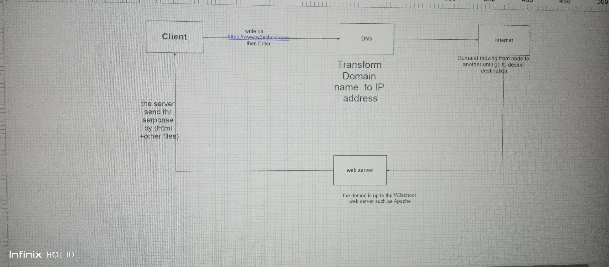

# sherif-El3Eng
## How does a browser request work?

So you type `https://www.w3schools.com` in Chrome and hit Enter — here's the journey your request takes:

1. **Browser (Client)** — grabs the URL you typed.
2. **DNS Resolver** — translates the domain name (`w3schools.com`) into an IP address (like `104.18.12.123`).
3. **Network/Routers** — your request travels through the internet via multiple routers to reach the destination.
4. **Web Server** — the actual server (Apache/Nginx) hosting w3schools receives the request and looks for the requested page (e.g., `index.html`).
5. **Response** — the server sends back the HTTP response: HTML page, CSS files, JS files, images, etc.
6. **Rendering** — your browser takes all that data and renders it into the page you actually see.

⚡ Fun fact: all of this happens in a fraction of a second, and if it's HTTPS, there's also an SSL/TLS handshake securing the connection before any data is even sent.
